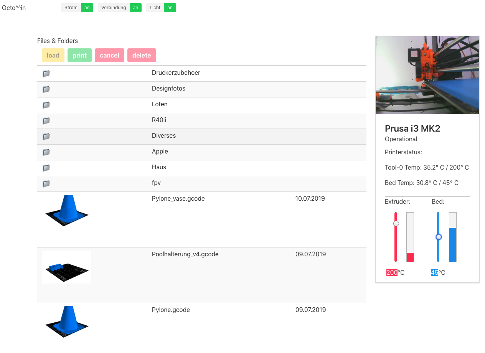

# octomin

webinterface for octoprint using native octoprint api.

purely html and javascript/jquery, no node npm installations and dependencies, just place repo inside a webserver's doc-root running inside your network.

edit config.js for your octoprint ip/port and your api key

# preview images
Place image/photo of your gcode model in same folder as the gcode file with the same name and file ending ".png" e.g.: your gcode-file is named vase.gcode, put an image named vase.png as preview image into same directory.

Generating images with the same look as in screenshots section below can be done with https://github.com/shodushi/gcode2png

# Screenshot
